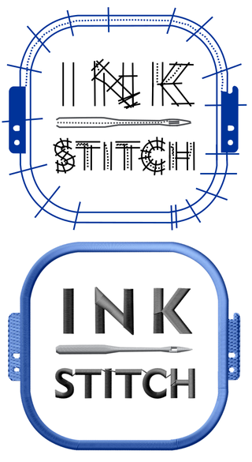

# Ink/Stitch: An open source machine embroidery design platform based on Inkscape

Want to design embroidery pattern files (PES, DST, and many more) using **free, open source software?**

Ink/Stitch aims to be a full-fledged embroidery digitizing platform based entirely on free, open source software.  Our goal is to be approachable for hobbyists while also providing the power needed by professional digitizers.

Want to learn more?

* Check out our list of [features](https://inkstitch.org/features/)
* [Quick Install](https://inkstitch.org/docs/install/) on Linux and Windows (Mac support in the works!)
* See some [photos](https://inkstitch.org/tutorials/inspiration/) showing what Ink/Stitch can do
* Watch some [videos](https://inkstitch.org/tutorials/video/) of Ink/Stitch in action
* ...and lots more on our [website](https://inkstitch.org)

# Background and Philosophy

_by @lexelby, an Ink/Stitch programmer_

I received a really wonderful christmas gift for a geeky programmer hacker: an [embroidery machine](http://www.brother-usa.com/homesewing/ModelDetail.aspx?ProductID=SE400).  It's pretty much a CNC thread-bot... I just had to figure out how to design programs for it.  The problem is, **all free embroidery design software seemed to be terrible**, especially when you add in the requirement of being able to run in Linux, my OS of choice.

I started off hacking on [inkscape-embroidery](http://www.jonh.net/~jonh/inkscape-embroidery/).  It had some of the basic capabilities I needed, and I saw a lot of potential.  I love the idea of using an existing, ultra-powerful SVG editor as the basis for an embroidery design suite.

Things took off from there.  I continued adding features as I needed them, and by this point, very little if any of the original code remains.

The goal of Ink/Stitch is to provide a powerful embroidery digitizing platform for everyone **completely free**.  I want to open up the field of embroidery design, making it approachable even for those who can't spend hundreds or thousands of dollars on software.  And I want folks like me, who love to combine code with art, to have an open, extensible, and approachable platform to hack on.

# License

ink/stitch: an extension for machine embroidery design using Inkscape
Copyright (C) 2010 Jon Howell
Copyright (C) 2015 Bas Wijnen - these additions also released under AGPLv3
Copyright (C) 2015 Steven Siegl
Copyright (C) 2016-2018 Lex Neva

This program is free software: you can redistribute it and/or modify
it under the terms of the GNU General Public License as published by
the Free Software Foundation, either version 3 of the License, or
(at your option) any later version.

This program is distributed in the hope that it will be useful,
but WITHOUT ANY WARRANTY; without even the implied warranty of
MERCHANTABILITY or FITNESS FOR A PARTICULAR PURPOSE.  See the
GNU General Public License for more details.

You should have received a copy of the GNU General Public License
along with this program.  If not, see <https://www.gnu.org/licenses/>.
